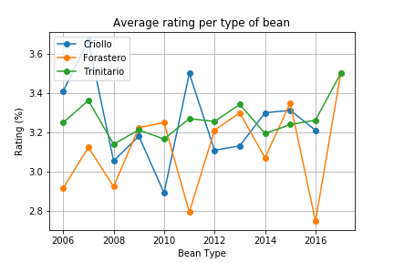
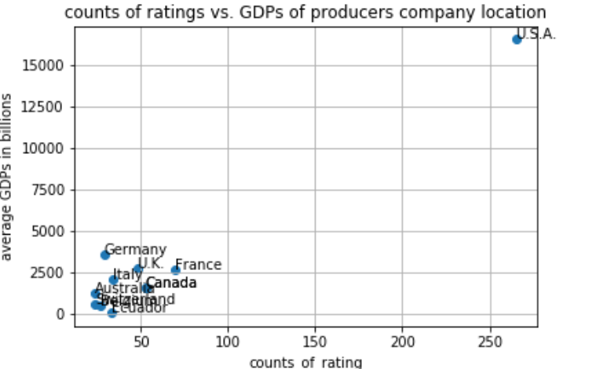
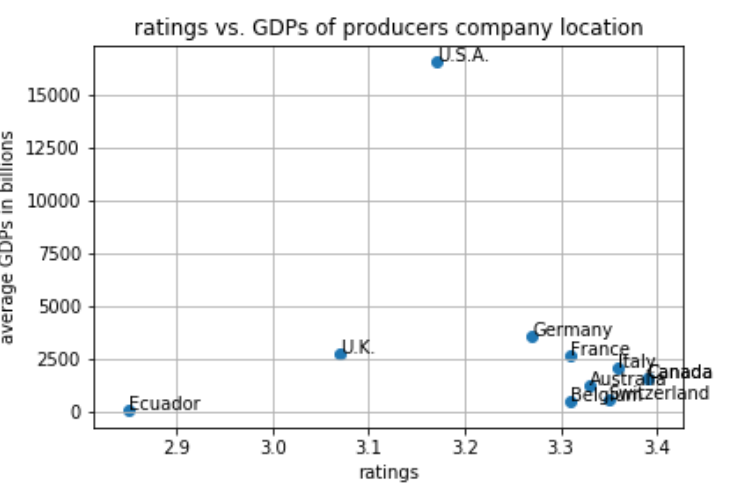
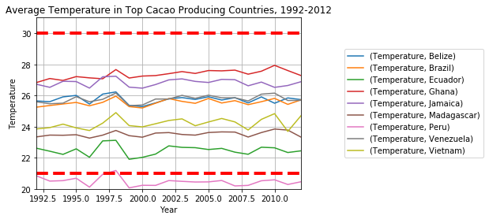

# Climate And Chocolate

Our project is to uncover patterns in chocolate beans around the world. We'll examine relationships between chocolate bars, along with information on their regional origin, percentage of cocoa, the variety of chocolate bean used and where the beans were grown.

We found the dataset on Kaggle called, “[Chocolate Bar Ratings](https://www.kaggle.com/rtatman/chocolate-bar-ratings#flavors_of_cacao.csv),” that contains expert ratings of over 1,700 individual chocolate bars. 

The analysis process was broken into two broad phases: Exploration & Cleanup and Analysis.

We used a Jupyter Notebook to explore, clean, and reformat our data before we could begin to answer the research questions.

**Cleanup & Exploration**
* Convert Objects
* Rename Columns
* Remove null values
* Drop NA
* Replace row content to get unique values
* and more

**Analysis**
* Top Rating Beans
* Bottom Rating Beans
* Create new df with only relevant columns and beans
* Top Country by Rating
* Top Beans by rating
* and more

**General Conclusions**

* The best rated chocolate comes from the Criollo bean.

* Countries that grow cacao for chocolate production are generally poorer than the countries where chocolate companies are headquartered.

* In some cacao growing countries, recent temperature readings have occurred outside of the ideal temperature range for cacao viability.

**Difficulties**

* We have chocolate dates from 2006 to 2017, but our climate data only goes up to 2013. Given that the past several years have been the hottest on record, our predictions for the future of cacao's viability in its growing climates would be enriched with more recent information.
* Missing data and small data sets served as a barrier for hypothesis testing. 

**Additional Inquiry**

* Humidity is perhaps even more important than temperature for cacao production -- look at global humidity trends in producing countries
* Does chocolate quality correlate with income of cacao farmers? Do companies that make better chocolate pay their farmers better?
* Is it possible to get more granular information about specific company's production processes? Perhaps production methods have more influence on quality than cacao source.

[Link to Prezi Presentation](https://prezi.com/view/1OGXVRNajgLmTZ4h42fe/)

**Link to Deployed project:**
[Climate And Chocolate](https://iris28kurti.github.io/climateandchocolate/index.html)

